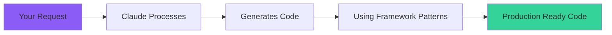

# 📗 Claude Integration Guide

Master the art of AI-powered WordPress development with Claude and the DevelopmentTranslation Bridge framework.

## Table of Contents
- [Introduction](#introduction)
- [How Claude Integration Works](#how-claude-integration-works)
- [Effective Prompting](#effective-prompting)
- [Common Patterns](#common-patterns)
- [Advanced Techniques](#advanced-techniques)
- [Best Practices](#best-practices)
- [Examples Gallery](#examples-gallery)

---

## Introduction

DevelopmentTranslation Bridge is specifically designed to work seamlessly with Claude AI, allowing you to describe what you want in natural language and receive production-ready WordPress code.

### Why Claude?

- **Context Awareness**: Claude understands the framework's structure
- **Code Quality**: Generates clean, well-documented code
- **WordPress Expertise**: Knows WordPress best practices
- **Bootstrap Knowledge**: Understands Bootstrap 5 components
- **Security Minded**: Includes proper sanitization and escaping

---

## How Claude Integration Works

### The AI Development Flow



### Framework Awareness

Claude recognizes these framework features:
- `DEVTB_Loop` - Advanced loop implementation
- `devtb_component()` - Bootstrap component renderer
- `devtb_ajax()` - AJAX handler registration
- `devtb_api_route()` - REST API endpoints
- Framework file structure

---

## Effective Prompting

### The Perfect Prompt Formula

```
"Using DevelopmentTranslation Bridge, [action] [what] with [features] using [Bootstrap components]"
```

### Examples of Good Prompts

✅ **Specific and Clear:**
```
"Using DevelopmentTranslation Bridge, create a Products custom post type 
with price, SKU, and gallery fields. Display in a Bootstrap card grid 
with filtering by category and AJAX load more button."
```

✅ **References Framework Features:**
```
"Using DevelopmentTranslation Bridge's DEVTB_Loop, create a featured posts 
section showing 3 posts with thumbnails in Bootstrap cards, ordered by 
a custom 'priority' meta field."
```

✅ **Includes Technical Details:**
```
"Using DevelopmentTranslation Bridge, add an AJAX contact form with nonce 
verification, honeypot field, and email validation. Show success/error 
messages using Bootstrap alerts."
```

### Examples of Poor Prompts

❌ **Too Vague:**
```
"Make a website"
```

❌ **Missing Context:**
```
"Add a slider" (Doesn't mention the framework)
```

❌ **Unrealistic:**
```
"Create a complete e-commerce site like Amazon"
```

---

## Common Patterns

### 1. Custom Post Types

**Prompt Template:**
```
"Using DevelopmentTranslation Bridge, create a [name] custom post type with 
[fields]. Include [taxonomies] and display using [Bootstrap component]."
```

**Claude Will Generate:**
- Post type registration
- Meta boxes for custom fields
- Taxonomy registration
- Display templates
- Admin columns
- REST API support

### 2. AJAX Functionality

**Prompt Template:**
```
"Using DevelopmentTranslation Bridge, add AJAX [action] that [does what] 
with [security measures] and [feedback]."
```

**Claude Will Generate:**
- JavaScript handler
- PHP AJAX action
- Nonce verification
- Error handling
- Loading states
- Success/error feedback

### 3. Custom Blocks

**Prompt Template:**
```
"Using DevelopmentTranslation Bridge, create a Gutenberg block for [purpose] 
with [controls] that outputs [Bootstrap component]."
```

**Claude Will Generate:**
- Block registration
- Editor interface
- Block controls
- Save function
- Frontend rendering
- Block styles

### 4. REST API Endpoints

**Prompt Template:**
```
"Using DevelopmentTranslation Bridge, create a REST API endpoint at [route] 
that [action] with [authentication] and returns [data]."
```

**Claude Will Generate:**
- Route registration
- Handler function
- Permission callbacks
- Data validation
- Response formatting
- Error handling

---

## Advanced Techniques

### Multi-Step Development

Break complex features into steps:

**Step 1:** Create the foundation
```
"Using DevelopmentTranslation Bridge, create an Events custom post type 
with date, time, and location fields."
```

**Step 2:** Add functionality
```
"Add a calendar view for the Events using Bootstrap components 
with month/week/day views."
```

**Step 3:** Enhance with features
```
"Add AJAX filtering for Events by category and date range 
with loading animations."
```

### Component Composition

Combine multiple components:

```
"Using DevelopmentTranslation Bridge, create a hero section combining:
- Bootstrap carousel for backgrounds
- Overlay with heading and text
- Call-to-action buttons
- Responsive for all devices"
```

### Plugin Conversion

Convert features to plugins:

```
"Convert the Events feature we created into a standalone WordPress 
plugin that works with any theme, maintaining Bootstrap compatibility."
```

---

## Best Practices

### 1. Always Reference the Framework

Start prompts with "Using DevelopmentTranslation Bridge" to ensure Claude uses framework patterns.

### 2. Be Specific About Requirements

Include:
- Data structure
- Display format
- User interactions
- Security needs
- Performance considerations

### 3. Request Documentation

Ask Claude to include:
```
"Include inline documentation and usage examples"
```

### 4. Think in Components

Break down features:
- Data layer (CPT, meta, taxonomies)
- Display layer (templates, components)
- Interaction layer (AJAX, forms)
- API layer (REST endpoints)

### 5. Iterate Intelligently

Start simple, then enhance:
1. Basic implementation
2. Add interactivity
3. Improve UX
4. Optimize performance
5. Add advanced features

---

## Examples Gallery

### Example 1: Portfolio with Filterable Gallery

**Prompt:**
```
"Using DevelopmentTranslation Bridge, create a Portfolio system with:
- Project custom post type
- Categories for filtering
- Custom fields: client, date, technologies used
- Masonry grid layout using Bootstrap
- AJAX filtering by category
- Lightbox for images
- Responsive design"
```

**Claude Provides:**
- Complete CPT setup
- Meta box implementation
- Masonry grid template
- AJAX filter system
- Lightbox integration
- Mobile optimization

### Example 2: Testimonials Carousel

**Prompt:**
```
"Using DevelopmentTranslation Bridge, create a testimonials feature:
- Testimonial CPT with author, company, rating
- Bootstrap carousel display
- Schema markup for SEO
- Shortcode with parameters
- Auto-rotate with pause on hover"
```

**Claude Provides:**
- CPT with custom fields
- Carousel implementation
- Structured data markup
- Flexible shortcode
- JavaScript controls

### Example 3: Advanced Search

**Prompt:**
```
"Using DevelopmentTranslation Bridge, create an advanced search:
- Search multiple post types
- Filter by categories, tags, custom fields
- AJAX live search results
- Search history
- Bootstrap modal for filters
- Highlight search terms in results"
```

**Claude Provides:**
- Multi-post-type search
- Complex query builder
- Live search AJAX
- LocalStorage history
- Modal filter interface
- Term highlighting

---

## Tips for Complex Projects

### Large Applications

For complex applications, break down into modules:

```
"Let's build a membership site. Start with:
1. User registration system using DevelopmentTranslation Bridge"

Then:
"2. Add member dashboard with Bootstrap components"

Then:
"3. Create content restriction system"
```

### Performance Optimization

Request optimizations explicitly:

```
"Optimize the Events listing for performance:
- Implement query caching
- Add lazy loading for images
- Paginate results
- Minimize database queries"
```

### Accessibility

Ensure accessibility:

```
"Make the Portfolio gallery fully accessible:
- ARIA labels
- Keyboard navigation
- Screen reader friendly
- WCAG 2.1 AA compliant"
```

---

## Troubleshooting Claude Output

### If Code Seems Incomplete

Ask for clarification:
```
"Please complete the implementation including all necessary functions"
```

### If Using Wrong Patterns

Remind about the framework:
```
"Please use DevelopmentTranslation Bridge's DEVTB_Loop class instead of WP_Query"
```

### If Missing Security

Request security features:
```
"Add proper nonce verification and data sanitization"
```

---

## Integration Checklist

When implementing Claude's code:

- [ ] Save files in correct directories
- [ ] Include files in functions.php
- [ ] Clear cache after adding features
- [ ] Test in different browsers
- [ ] Check mobile responsiveness
- [ ] Verify AJAX endpoints
- [ ] Test with debug mode on
- [ ] Add to version control

---

## Next Steps

1. 📙 **[The Loop Mastery](the-loop.md)** - Master WordPress queries
2. 📕 **[Bootstrap Components](bootstrap-components.md)** - UI components guide
3. 📓 **[API Development](api-development.md)** - Build REST APIs

---

**Start building with Claude now - describe your vision and watch it come to life! 🤖**
